# Blender-MCP + Hunyuan3D 整合系统

这个项目将 Hunyuan3D-2.1 的 2D 转 3D 功能与 blender-mcp 的 Blender 控制功能整合在一起，提供了一个完整的文本到 3D 场景的工作流程。

## 功能特性

### 🎯 核心功能
- **文本生成图像**: 使用 Stable Diffusion 从文本描述生成高质量图像
- **图像转 3D 模型**: 使用 Hunyuan3D-2.1 将 2D 图像转换为 3D 模型
- **Blender 集成**: 自动将生成的 3D 模型导入到 Blender 中
- **场景增强**: 自动添加灯光、相机和基础场景设置
- **统一工作流程**: 一键完成从文本到完整 3D 场景的转换

### 🔧 新增 MCP 工具

1. **`generate_stable_diffusion_image`**: 文本生成图像
2. **`generate_hunyuan3d_model`**: 图像转 3D 模型
3. **`create_3d_scene_from_text`**: 完整的文本到 3D 场景工作流程

## 安装和设置

### 1. 环境要求
- Python 3.8+
- Blender 3.0+
- CUDA 支持的 GPU (推荐)
- 至少 8GB GPU 显存

### 2. 安装依赖
```bash
cd blender-mcp
pip install -r requirements.txt
```

### 3. 启动 Hunyuan3D API 服务器
确保 Hunyuan3D-2.1 API 服务器在 `http://localhost:8081` 运行。

### 4. 配置 Blender MCP
1. 在 Blender 中安装 `addon.py` 插件
2. 启动 MCP 服务器：
```bash
python -m blender_mcp.server
```

## 使用示例

### 示例 1: 完整工作流程 - 从文本创建 3D 场景

```python
# 使用 create_3d_scene_from_text 工具
result = create_3d_scene_from_text(
    scene_description="一只可爱的卡通猫咪坐在草地上",
    generate_image=True,
    image_width=512,
    image_height=512,
    remove_background=True,
    texture=True,
    seed=42
)
```

这个命令会：
1. 生成一张卡通猫咪的图像
2. 将图像转换为 3D 模型
3. 导入到 Blender
4. 添加灯光和相机
5. 设置基础场景

### 示例 2: 分步骤工作流程

#### 步骤 1: 生成图像
```python
image_result = generate_stable_diffusion_image(
    prompt="一个现代风格的椅子，简约设计，白色背景",
    negative_prompt="复杂的装饰，暗色背景",
    width=512,
    height=512,
    seed=123
)
```

#### 步骤 2: 转换为 3D 模型
```python
model_result = generate_hunyuan3d_model(
    image_path="/path/to/generated/image.png",
    remove_background=True,
    texture=True,
    seed=123
)
```

#### 步骤 3: 在 Blender 中进一步编辑
```python
# 使用 execute_blender_code 添加自定义修改
blender_code = """
import bpy

# 选择导入的模型
obj = bpy.context.active_object

# 添加材质
mat = bpy.data.materials.new(name="CustomMaterial")
mat.use_nodes = True
obj.data.materials.append(mat)

# 设置材质属性
bsdf = mat.node_tree.nodes["Principled BSDF"]
bsdf.inputs[0].default_value = (0.8, 0.2, 0.2, 1.0)  # 红色
bsdf.inputs[7].default_value = 0.1  # 粗糙度
"""

execute_blender_code(code=blender_code)
```

## 工作流程详解

### 文本 → 图像 → 3D 模型 → Blender 场景

```mermaid
graph LR
    A[文本描述] --> B[Stable Diffusion]
    B --> C[生成图像]
    C --> D[Hunyuan3D API]
    D --> E[3D GLB 模型]
    E --> F[Blender 导入]
    F --> G[场景增强]
    G --> H[完整 3D 场景]
```



### 技术架构

1. **MCP 服务器** (`server.py`)
   - 提供 MCP 工具接口
   - 处理 AI 模型调用
   - 管理工作流程

2. **Blender 插件** (`addon.py`)
   - 处理 3D 模型导入
   - 执行 Blender 操作
   - 管理场景设置

3. **AI 模型集成**
   - Stable Diffusion: 文本生成图像
   - Hunyuan3D: 图像转 3D 模型

## 高级用法

### 自定义提示词模板

```python
# 为不同类型的对象定义提示词模板
templates = {
    "furniture": "modern {item}, minimalist design, clean lines, white background, product photography",
    "character": "cute cartoon {item}, 3D render, colorful, friendly expression, simple background",
    "vehicle": "sleek {item}, futuristic design, metallic finish, studio lighting"
}

# 使用模板
furniture_prompt = templates["furniture"].format(item="chair")
result = create_3d_scene_from_text(
    scene_description=furniture_prompt,
    generate_image=True
)
```

### 批量处理

```python
# 批量创建多个 3D 模型
items = ["苹果", "香蕉", "橙子"]

for item in items:
    result = create_3d_scene_from_text(
        scene_description=f"一个新鲜的{item}，白色背景，产品摄影风格",
        generate_image=True,
        seed=hash(item) % 10000  # 为每个物品使用不同的种子
    )
    print(f"{item} 3D 模型创建完成")
```

## 故障排除

### 常见问题

1. **GPU 内存不足**
   - 减少图像分辨率 (256x256)
   - 使用 CPU 模式（较慢）
   - 关闭其他 GPU 应用程序

2. **Hunyuan3D API 连接失败**
   - 检查 API 服务器是否运行
   - 验证 URL 和端口设置
   - 检查防火墙设置

3. **Blender 导入失败**
   - 确保 Blender 插件已正确安装
   - 检查 GLB 文件是否有效
   - 验证文件路径权限

### 性能优化

1. **使用 GPU 加速**
   ```python
   # 在生成图像时指定设备
   device = "cuda" if torch.cuda.is_available() else "cpu"
   ```

2. **模型缓存**
   - Stable Diffusion 模型会自动缓存
   - 首次运行需要下载模型（约 5GB）

3. **内存管理**
   - 定期清理临时文件
   - 使用较小的批处理大小

## 贡献指南

欢迎提交 Issue 和 Pull Request！

### 开发环境设置
```bash
git clone <repository>
cd blender-mcp
pip install -r requirements.txt
pip install -e .
```

### 测试
```bash
pytest tests/
```

## 许可证

本项目遵循 MIT 许可证。

## 致谢

- [Hunyuan3D-2.1](https://github.com/Tencent/Hunyuan3D-2) - 腾讯的 2D 转 3D 模型
- [Stable Diffusion](https://github.com/Stability-AI/stablediffusion) - 文本生成图像模型
- [Blender](https://www.blender.org/) - 开源 3D 创作套件
- [FastMCP](https://github.com/jlowin/fastmcp) - MCP 服务器框架